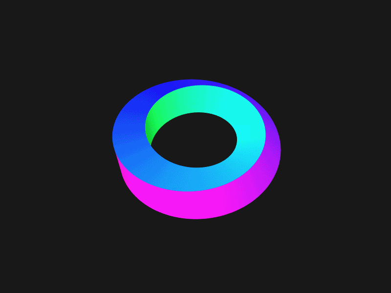
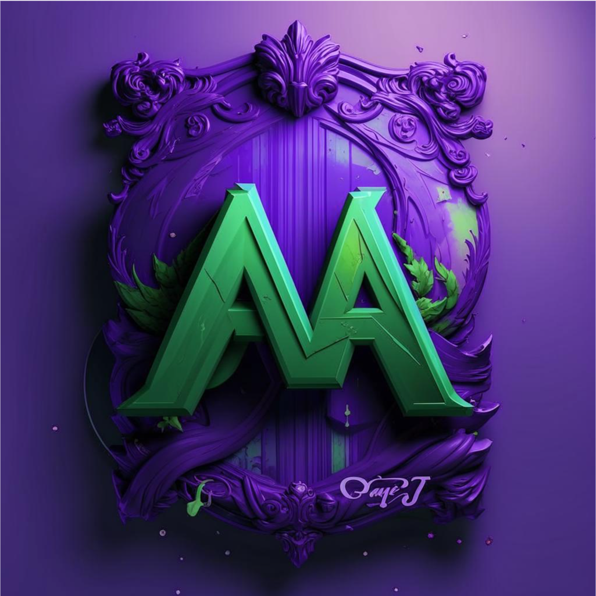

# 👋 Привет! Меня зовут   &nbsp;&nbsp;&nbsp;&nbsp;&nbsp;&nbsp;Аптуков Михаил

  
  
  

## 📚 О себе

Я увлечённый программист с большим интересом к изучению новых технологий и подходов в разработке программного обеспечения.
Мне нравится разбираться в сложных системах, находить решения нестандартных задач и постоянно расширять свои знания.
Я активно изучаю современные инструменты и технологии.
Кроме того, я увлекаюсь спортом, что помогает мне поддерживать физическую активность и сохранять баланс между работой и личной жизнью.

## 💡 Мои навыки 

## 🚀 Мои проекты

### 🤖 Телеграм-боты
- 📅 **[Бот для создания напоминаний](https://github.com/LuckyAm20/API)**: Бот позволяет создавать одноразовые и повторяющиеся напоминания, а также прикреплять файлы. Данные хранятся в SQLite базе данных и на Google Drive.
- 🎵🎬 **[Бот для рекомендаций музыки и фильмов](https://github.com/LuckyAm20/MediaBot)**: Этот бот предлагает рекомендации по музыке и фильмам на основе knn алгоритма.
- 🏋️‍♂️ **[Бот для взаимодействия между тренером и спортсменом](https://github.com/LuckyAm20/tg_bot_gym)**: Бот облегчает взаимодействие между тренером и спортсменом, позволяя отслеживать тренировки и прогресс.

### 📊 Визуализация и алгоритмы
- 🗺️ **[Визуализация задачи коммивояжера](https://github.com/LuckyAm20/Traveling_salesman_task)**: Визуализация решения задачи коммивояжера с использованием генетического и муравьиного алгоритмов.
- 🐍 **[Игра Змейка](https://github.com/LuckyAm20/SnakeGame)**: Классическая игра змейка, реализованная с использованием принципов объектно-ориентированного программирования (ООП).

## 🏆 Мои достижения на платформах для программирования

## 📱 Социальные сети
- 
- 
